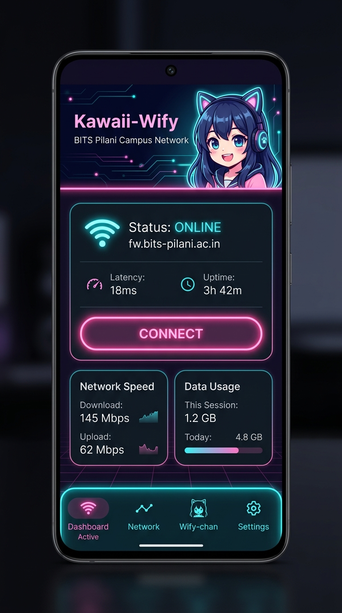

# Kawaii-Wify Android: Architecture & Design Specification

> **Theme:** Cyber-Kawaii Dark / AMOLED Neon  
> **Mascot:** Wify-chan (Cyber-Guardian Daemon Companion)  
> **Platform:** Android 8.0+ (API 26) → Target Android 15 (API 35)  
> **Tech Stack:** Kotlin, Jetpack Compose, OkHttp 4, Coroutines & StateFlow, EncryptedSharedPreferences (Hardware KeyStore)

---

## 1. Visual Aesthetics & Theme Identity

The Android application merges **high-contrast dark UI (AMOLED blacks and deep violet-slate)** with **vibrant cyber-kawaii neon accents (Sakura Pink `#FF69B4`, Electric Cyan `#00F0FF`, Neon Lavender `#BD93F9`, and Mint `#50FA7B`)**.

### Color Palette

| Token | Hex Value | Role & Usage |
| :--- | :--- | :--- |
| `BgDark` | `#0A0B10` | Base AMOLED background |
| `SurfaceDark` | `#12131F` | Elevated card surfaces and bottom sheets |
| `SurfaceGlass` | `#1A1B2D` *(40% blur)* | Glassmorphic overlay cards and telemetry panels |
| `SakuraNeon` | `#FF69B4` | Primary brand accent, glowing connect button, mascot highlights |
| `CyberCyan` | `#00F0FF` | Online indicator, validated network pings, active state badge |
| `MintGreen` | `#50FA7B` | Success states, keepalive heartbeat pulse |
| `AlertOrange` | `#FFB86C` | Captive portal detected, captive intercept state |
| `CrimsonRed` | `#FF5555` | Auth failure, cooldown suspension, error logs |
| `TextPrimary` | `#F8F8F2` | Headings, primary labels |
| `TextSecondary`| `#6272A4` | Subtitles, timestamps, dimmed metadata |

### Wify-chan: Dynamic Mascot States

Wify-chan serves as the emotional and visual anchor of the application. The mascot reacts reactively to the engine state:

| Engine State | Mascot Pose | Visual Emotion & Persona |
| :--- | :--- | :--- |
| **`ONLINE`** |  | Victory peace sign, cheerful wink, glowing cyan headphones, pulsing Wi-Fi aura.<br>*"Connection secured! You're online, senpai! (◕‿◕)✌"* |
| **`OFFLINE` / `PAUSED`** |  | Curled up asleep with kitten blanket, cat-ear headphones resting, soft purple night glow.<br>*"Zzz... Engine is resting. Tap connect to wake me up! (ᴗ˳ᴗ)"* |
| **`CAPTIVE` / `PROBING`** | Concentrating Hacker Pose | Typing furiously on holographic terminal, cat ears perked up, blinking orange status.<br>*"Captive portal detected! Priming FortiGate challenge..."* |
| **`COOLDOWN`** | Pouting / Dizzy Chibi | Crossed arms or spinning spiral eyes, alert badge warning against account lockout.<br>*"Too many auth fails! Resting in cooldown to save your account!"* |

---

## 2. Complete CLI Feature Parity Matrix

Every single CLI capability from `kawaii-wify` is cleanly mapped into native Android UX:

| CLI Command | Equivalent Android UI / System Feature | Implementation Mechanism |
| :--- | :--- | :--- |
| `kawaii-wify login` | **Credentials Bottom Sheet & Onboarding**<br>Prompts for campus username and password, test-auths immediately. | `EncryptedSharedPreferences` backed by Android KeyStore (AES-256 GCM). |
| `kawaii-wify logout` | **Purge Account & Remote Session Termination**<br>Action button in Settings/Profile. | Calls FortiGate `/logout?<token>`, wipes KeyStore entries, transitions mascot to sleep. |
| `kawaii-wify connect` | **1-Tap Glowing Connect Button**<br>Manual trigger to immediately wake engine, bind socket, prime, and log in. | Dispatches `EngineAction.Connect` through Coroutine Channel to `KeepaliveForegroundService`. |
| `kawaii-wify disconnect` | **1-Tap Disconnect / Pause Button**<br>Pauses daemon, revokes session on FortiGate, unbinds socket. | Dispatches `EngineAction.Disconnect`, calls `/logout?<token>`, updates notification. |
| `kawaii-wify status` | **Live Telemetry Cards & JSON Inspector**<br>Shows State, User, Uptime, Last Probe time, Session Token, and Latency. | StateFlow collector updating Compose dashboard in real time + "Copy Telemetry JSON" button. |
| `kawaii-wify start` | **Enable Background Service / Auto-Connect**<br>Starts the persistent Android Foreground Service. | `ContextCompat.startForegroundService()` with sticky notification and boot auto-start. |
| `kawaii-wify stop` | **Stop Daemon Service**<br>Completely terminates the Android Foreground Service. | `stopService()` on `KeepaliveForegroundService`. |
| `kawaii-wify logs` | **In-App Cyberpunk Terminal**<br>Color-coded logs with tag filtering (`[AUTH]`, `[NET]`, `[STATE]`, `[ERROR]`). | Rolling in-memory log buffer (500 lines) + File logger (`filesDir/daemon.log`), share/export intent. |
| `kawaii-wify config get/set` | **Config Settings Panel**<br>Gateway URL, Interval slider (2s–60s), Keepalive toggle, AutoConnect toggle. | Jetpack DataStore Preferences with reactive UI synchronization. |
| *(CLI has no Tile)* | **Quick Settings Tile (`KawaiiTileService`)**<br>1-tap toggle from Android notification shade. | Android `TileService` linked to the foreground service state. |
| *(CLI has no SSID filter)* | **SSID Whitelist Filter**<br>Only activate on campus Wi-Fi (e.g., `BITS-Pilani`). | Reads current SSID from `WifiInfo` / `NetworkCapabilities` before initiating probes. |

---

## 3. Android System Architecture

### Architectural Overview

```text
┌────────────────────────────────────────────────────────────────────────────────────────┐
│                                   ANDROID SYSTEM LAYER                                 │
│                                                                                        │
│   ┌───────────────────────────┐   ┌──────────────────────────┐   ┌─────────────────┐   │
│   │ ConnectivityManager       │   │ Quick Settings Tile      │   │ System Battery  │   │
│   │ (NetworkCallback)         │   │ (KawaiiTileService)      │   │ (Doze Exemption)│   │
│   └─────────────┬─────────────┘   └────────────┬─────────────┘   └────────┬────────┘   │
└─────────────────┼──────────────────────────────┼──────────────────────────┼────────────┘
                  │ onCapabilitiesChanged        │ Toggle Connect/Pause     │
                  ▼                              ▼                          │
┌───────────────────────────────────────────────────────────────────────────┼────────────┐
│                             KAWAII-WIFY ANDROID CORE                      │            │
│                                                                           │            │
│   ┌───────────────────────────────────────────────────────────────────┐   │            │
│   │ KeepaliveForegroundService (Sticky Foreground Service)            │◄──┘            │
│   │   • Ongoing notification with Wify-chan mascot & quick actions    │                │
│   │   • Holds WakeLock during auth handshake                          │                │
│   │   • Manages Keepalive ticker while connected to campus SSID       │                │
│   └─────────────────────────────────┬─────────────────────────────────┘                │
│                                     │ Calls                                            │
│                                     ▼                                                  │
│   ┌───────────────────────────────────────────────────────────────────┐                │
│   │ Network Controller (OkHttp + Android Network Binding)             │                │
│   │   • MUST bind process/sockets via Network.bindSocket()            │                │
│   │   • auth.Probe -> auth.Prime -> auth.Login -> auth.Keepalive      │                │
│   └───────────────────┬───────────────────────────────┬───────────────┘                │
│                       │ Reads credentials             │ Reads config                   │
│                       ▼                               ▼                                │
│   ┌───────────────────┴───────────────┐   ┌───────────┴───────────────┐                │
│   │ EncryptedSharedPreferences        │   │ DataStore Preferences     │                │
│   │ (Android KeyStore - AES-256 GCM)  │   │ (SSID filter, intervals)  │                │
│   └───────────────────────────────────┘   └───────────────────────────┘                │
└────────────────────────────────────────────────────────────────────────────────────────┘
```

### Solving Android Constraints

#### 1. The Socket Routing Trap (`bindProcessToNetwork`)
* **Problem:** When Android connects to a network with `NET_CAPABILITY_CAPTIVE_PORTAL`, the OS flags the network as unvalidated. If mobile data is active, Android routes HTTP probes via cellular, causing `172.16.100.1` or `fw.bits-pilani.ac.in` requests to fail.
* **Solution:** 
  ```kotlin
  // Bind all process HTTP traffic directly to the Wi-Fi network interface
  connectivityManager.bindProcessToNetwork(wifiNetwork)
  ```
  Additionally, supply an OkHttp `SocketFactory` tied to `network.socketFactory` for explicit per-request socket binding.

#### 2. Event-Driven Wakeups vs. Battery-Draining 10s Polling
* Rather than keeping a CPU thread awake 24/7, register a `ConnectivityManager.NetworkCallback`.
* The OS triggers `onCapabilitiesChanged` the exact millisecond captive portal state changes.
* Keepalive pings run on an alarm or coroutine ticker **only** when `State == ONLINE` and `keepalive == true`.

#### 3. Android 14+ (API 34/35) Foreground Service Declaration
* Service Type: `android:foregroundServiceType="dataSync"`.
* Notification Channel: `IMPORTANCE_LOW` with custom view displaying Wify-chan avatar, live status, and action buttons (`[ Disconnect ]`, `[ View Logs ]`).

---

## 4. UI/UX Design & Screen Breakdown

### App UI Mockup



### Screen 1: Dashboard (Main Tab)
* **Top Hero Banner:** Glowing mascot container showcasing Wify-chan in her current state, campus badge (`"BITS Pilani Campus Network"`), and live connection beacon.
* **Status Card:** Large glowing card indicating `ONLINE`, `CAPTIVE PORTAL DETECTED`, or `OFFLINE`, active gateway (`fw.bits-pilani.ac.in:8090`), and ping latency (e.g. `18ms`).
* **Main Action Pill:** Massive cyberpunk button with glowing neon border:
  * When Offline/Captive: Pulsing Pink `CONNECT` button.
  * When Online: Sleek Cyan/Violet `DISCONNECT` button.
* **Telemetry Grid:**
  * ⏱ **Uptime:** Real-time counter (`03h 42m 15s`).
  * 🔍 **Last Probe:** Timestamp of most recent check (`15:04:05`).
  * 🔑 **Session Token:** Masked session hash (`4433/a9f...`) with 1-tap copy button.
  * 🛡 **Account:** Active user ID (`2023B5A30814P`).

### Screen 2: Terminal Logs (Logs Tab)
* **Cyberpunk Console:** Jet-black terminal background with glowing monospace font (JetBrains Mono / Fira Code).
* **Tag Filter Chips:** Horizontal scrolling filter chips: `ALL`, `[STATE]`, `[AUTH]`, `[NET]`, `[BOOT]`, `[WARN]`, `[ERROR]`.
* **Controls:** 
  * "Auto-scroll to bottom" switch.
  * Search filter bar.
  * "Export Log File" (invokes Android Share sheet to send `daemon.log`).
  * "Clear Log" button.

### Screen 3: Settings & Gateway Config (Settings Tab)
* **Identity Management:** Update username, change password (stored in Android KeyStore), "Log Out & Wipe KeyStore".
* **Gateway Configuration:**
  * Endpoint address input (`fw.bits-pilani.ac.in:8090` or custom gateway).
  * TLS Skip Host Mismatch toggle (matching Go's custom certificate verifier).
* **Daemon Engine Settings:**
  * Check Interval Slider: `2s` to `60s` (Default: `10s`).
  * Session Keepalive toggle (periodic silent ping to maintain lease).
  * Auto-Connect toggle (automatically initiate handshake on captive detection).
* **Network & Power Optimization:**
  * Campus SSID Whitelist: Multi-tag input (`BITS-Pilani`, `BITS-Hostel`, `eduroam`).
  * Battery Optimization Exemption: One-tap button opening `ACTION_REQUEST_IGNORE_BATTERY_OPTIMIZATIONS`.

---

## 5. Technical Architecture & File Layout

```text
android/
├── build.gradle.kts
├── settings.gradle.kts
└── app/
    ├── build.gradle.kts
    └── src/main/
        ├── AndroidManifest.xml
        └── java/com/obliviousorion/kawaiiwify/
            ├── KawaiiApplication.kt                 # Application class & DI setup
            ├── auth/
            │   ├── FortiGateAuth.kt                 # OkHttp port of Go Gateway (Probe, Prime, Login, Keepalive, Logout)
            │   ├── HostVerifier.kt                 # Scoped TLS Certificate validator
            │   └── ProbeResult.kt                   # Sealed class: Online, Captive(magicToken), Offline
            ├── engine/
            │   ├── EngineState.kt                   # Offline, Captive, Online, Cooldown
            │   ├── SessionEngine.kt                 # State machine matching Go internal/engine
            │   └── Telemetry.kt                     # Uptime, Latency, SessionToken, FailCount
            ├── service/
            │   ├── KeepaliveForegroundService.kt    # Sticky foreground service & NotificationCompat
            │   ├── CaptivePortalCallback.kt         # ConnectivityManager network listener & socket binding
            │   ├── KawaiiTileService.kt             # Quick Settings Tile provider
            │   └── BootReceiver.kt                  # Auto-start on device reboot
            ├── data/
            │   ├── SecurityManager.kt               # EncryptedSharedPreferences (Hardware KeyStore)
            │   ├── PreferencesManager.kt            # DataStore (SSID whitelist, gateway, interval)
            │   └── LogRepository.kt                 # Rolling memory buffer + file log writer (daemon.log)
            └── ui/
                ├── theme/
                │   ├── Color.kt                     # AMOLED dark palette & Kawaii neon tokens
                │   ├── Theme.kt                     # KawaiiWifyTheme composable
                │   └── Type.kt                      # Typography & JetBrains Mono monospace styles
                ├── components/
                │   ├── MascotBanner.kt              # Dynamic Wify-chan state container
                │   ├── GlowingButton.kt             # Cyberpunk animated neon button
                │   ├── TelemetryCard.kt             # Glassmorphic telemetry stat boxes
                │   └── ConsoleLogViewer.kt          # Monospace live terminal with tag highlighting
                ├── screens/
                │   ├── DashboardScreen.kt           # Main telemetry & connection screen
                │   ├── LogsScreen.kt                # Real-time cyberpunk terminal log screen
                │   └── SettingsScreen.kt            # Config, SSIDs, and account credentials
                └── MainActivity.kt                  # Single-activity Jetpack Compose navigation host
```
